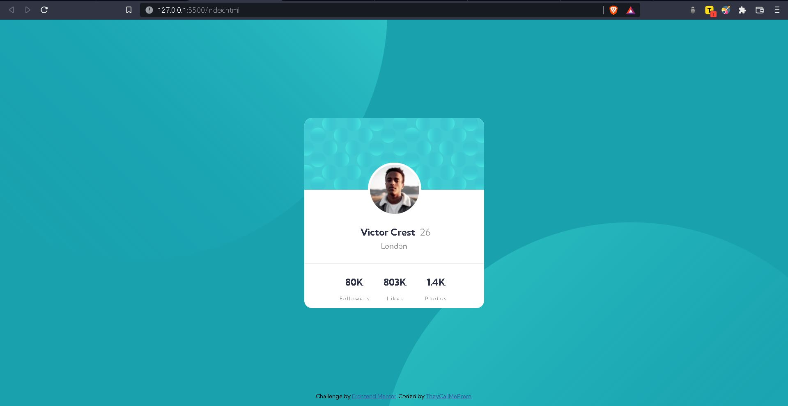

# Frontend Mentor - Profile card component solution

This is a solution to the [Profile card component challenge on Frontend Mentor](https://www.frontendmentor.io/challenges/profile-card-component-cfArpWshJ). Frontend Mentor challenges help you improve your coding skills by building realistic projects.

## Table of contents

- [Overview](#overview)
  - [The challenge](#the-challenge)
  - [Screenshot](#screenshot)
  - [Links](#links)
- [My process](#my-process)
  - [Built with](#built-with)
  - [What I learned](#what-i-learned)
- [Author](#author)

## Overview

### The challenge

- Build out the project to the designs provided

### Screenshot



### Links
- Live Site URL: [Click](https://theycallmeprem.github.io/Profile-card-component/)

## My process

### Built with

- Semantic HTML5 markup
- CSS custom properties
- Flexbox

### What I learned

I learned quite a few things like converting square image to circular, positioning an image over two 'div's etc. but the real challenge was positioning the background svgs to produce expected look. The snippet below shows the code for the same.

```css
body {
	line-height: 1.6;
	font-family: "Kumbh Sans", sans-serif;
	background-color: var(--cyan);
	background-image: url("./images/bg-pattern-top.svg"),
		url("./images/bg-pattern-bottom.svg");

	background-repeat: no-repeat;
	background-position: left -40% top 225%, left 132.5% top -175%;
}
```

If you want more help with writing markdown, we'd recommend checking out [The Markdown Guide](https://www.markdownguide.org/) to learn more.

## Author

- Github - [TheyCallMePrem](https://github.com/TheyCallMePrem)
- Frontend Mentor - [@TheyCallMePrem](https://www.frontendmentor.io/profile/TheyCallMePrem)
- Twitter - [@TheyCallMe_Prem](https://twitter.com/TheyCallMe_Prem)
